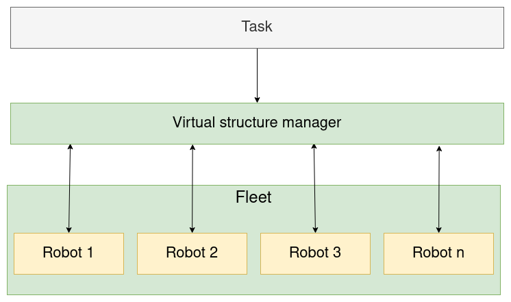
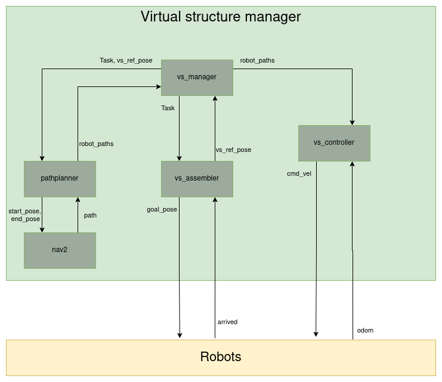

System Overview
----------------

In :ref:`topview-image-label`. the topview architecture of the entire software is shown. 
Task is the task that will be executed by the robots.
This will enter the VS manager where the paths for the robots are calculated and the robots are assembled. 
The VS manager communicates with the robots through MQTT.

   figure 1: Topview of the software architecture

In figure :ref:`overviewmanager-image-label` the architecture of the virtual structure manager is shown.
The dotted lines indicate the communication over MQTT. The solid lines indicate communication over the ROS network.

The vs_manager is the main node, responsible for calling services and action to complete the incoming task. 

The pathplanner is node that acts as a service server. The pathplanner is responsible for calculating the path for each of the robots. 
For the pathplanner it is possible to have a nav2 path as input.

The Assembler is also a node that acts as an service server. The Assembler is responsible for assembling the robots.

The VS_Controller is a node that acts as an action server. 
The VS_Controller is responsible for sending the velocity commands to the robots so that they synchronously follow their routes.

   figure 2: Overview of the virtual structure manager

The Robots and the VS manager both use ROS2 internally. For communication between the robots and the VS manager MQTT is used.
MQTT is used because it is a lightweight protocol that is easy to use and during testing it was found that it is more reliable than ROS2 communication over the network.
The robots are running a MQTT to ROS bridge. This bridge is responsible for turning the ROS messages into MQTT messages and the otherway around.
